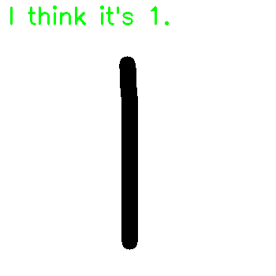
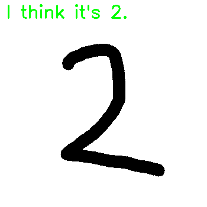
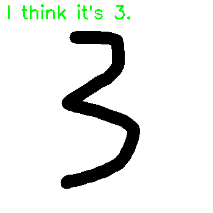
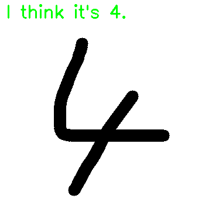
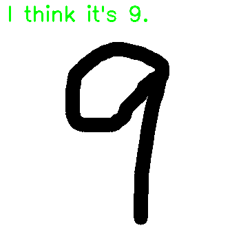

# CNN-MNIST
使用`卷积神经网络`实现手写数字识别




### 快速使用手册:

1. 安装 Anaconda 3.x 版本
2. 创建环境：`conda env create -f environment.yaml`
3. 运行测试程序: `python cnn_app.py`


### 网络结构：

`输入`->`卷积层1` ->`MaxPooling1`->`卷积层2`->`MaxPooling2`->`一个中间层500个神经元全连接网络`->`输出`


### 训练过程: `cnn_mnist_train.py`

- 优化器：GradientDescentOptimizer
- 防止过拟合: 使用`0.95`的`Dropout`保持率防止过拟合
- 支持断点续训功能，不怕意外丢失训练模型[因此训练过程可以随时中断]

### 训练过程存在问题:

- 训练收敛过程的收敛速度慢
- 精确度：收敛到0.98左右(全全连接曾中间节点为500个，还可以增加)


### 模型的使用:`cnn_app.py`

该程序让你可以现场用鼠标写一个数字，随后通过训练好的模型对手写数字进行识别。

功能:

- 鼠标在做图板上写下待识别的数字
- 按下`s`键保存图片，终端显示识别出的数字


### 运行环境:`environment.yaml`

推荐使用`Anaconda`环境运行程序，使用`conda`安装和我一样的环境可用如下命令:

```
conda env create -f environment.yaml
```


### 待做事项:

- [ ] 增加最后全连接层中间层的神经元个数，并训练
- [ ] 添加`Tensorboad`,可视化神经网络

---